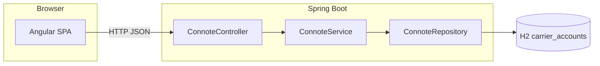

# Connote

Consignment tracking ID manager for logistics carriers. Register carrier accounts with configurable numeric ranges, then issue sequential, checksum-validated tracking IDs from a web UI or REST API.

## Table of contents

- [Overview](#overview)
- [Features](#features)
- [Architecture](#architecture)
- [Tech stack](#tech-stack)
- [Prerequisites](#prerequisites)
- [Quick start](#quick-start)
- [Configuration](#configuration)
- [API reference](#api-reference)
- [Tracking ID algorithm](#tracking-id-algorithm)
- [Validation rules](#validation-rules)
- [Database and seed data](#database-and-seed-data)
- [Testing](#testing)
- [Project structure](#project-structure)

## Overview

**Connote** (consignment note) solves a narrow logistics problem: each carrier needs unique, deterministic tracking numbers within an allocated index band. The system:

1. **Onboards carriers** with account metadata, digit width, and allowed index range.
2. **Generates the next ID** per carrier by incrementing a stored counter, formatting the index, and appending a checksum digit.

The repository is a monorepo with a **Spring Boot** API and an **Angular** SPA.

## Features

| Area | Capability |
|------|------------|
| Carrier setup | Create accounts with name, account number, digit count, initial index, and range |
| ID generation | Sequential IDs with prefix + zero-padded index + checksum |
| Carrier listing | Sorted, case-insensitive carrier list for the UI dropdown |
| Validation | Server-side Bean Validation plus custom range rules; matching client-side form validators |
| Errors | Consistent JSON error payloads with HTTP status, message, and path |
| UI | Generate page (searchable carrier picker, copy to clipboard) and setup page (success dialog) |
| Dev data | H2 seed script with sample carriers (FedEx, DHL, FreightmateCourierCo) |

## Architecture



| Layer | Responsibility |
|-------|----------------|
| `frontend/` | Angular 21 UI, Tailwind CSS, calls `/api/v1/connote` |
| `backend/` | REST API, business rules, JPA persistence |
| H2 (default) | In-memory `carrier_accounts` table; data reset on restart |

Default ports:

| Service | URL |
|---------|-----|
| Frontend | http://localhost:4200 |
| Backend API | http://localhost:8080/api/v1/connote |
| H2 console | http://localhost:8080/h2-console |

## Tech stack

**Backend**

- Java 21
- Spring Boot 4.0.6 (Web MVC, Data JPA, Validation)
- H2 Database
- Lombok
- JUnit 5, Mockito, AssertJ

**Frontend**

- Angular 21
- TypeScript 5.9
- Tailwind CSS 4
- Vitest (unit tests via `@angular/build:unit-test`)

## Prerequisites

| Tool | Version |
|------|---------|
| JDK | 21+ |
| Maven | 3.9+ (or use `./mvnw` if present) |
| Node.js | 20+ recommended |
| npm | 11+ (project pins `packageManager` in `frontend/package.json`) |

## Quick start

Run the API first, then the UI.

### 1. Start the backend

```bash
cd backend
mvn spring-boot:run
```

Verify: `GET http://localhost:8080/api/v1/connote/carriers` returns seed carriers.

### 2. Start the frontend

```bash
cd frontend
npm install
npm start
```

Open http://localhost:4200. Default route redirects to **Generate**.

### 3. Try it

1. **Generate**: pick `FreightmateCourierCo` (or another seed carrier) and click **Generate tracking ID**.
2. **Setup**: go to **Setup carrier**, register a new carrier, then return to **Generate**.

### Build for production

```bash
# Backend JAR
cd backend
mvn -q clean package -DskipTests
java -jar target/connote-0.0.1-SNAPSHOT.jar

# Frontend static assets
cd frontend
npm run build
# Output: frontend/dist/frontend/
```

Serve the built SPA behind a reverse proxy and point `apiBaseUrl` at your API host (see [Configuration](#configuration)).

## Configuration

### Backend (`backend/src/main/resources/application.yml`)

| Property | Default | Description |
|----------|---------|-------------|
| `spring.datasource.url` | `jdbc:h2:mem:carrierdb` | In-memory H2 database |
| `spring.jpa.hibernate.ddl-auto` | `update` | Auto schema from entities |
| `spring.sql.init.mode` | `always` | Runs `data.sql` on startup |
| `spring.h2.console.enabled` | `true` | H2 web console at `/h2-console` |

H2 console JDBC URL: `jdbc:h2:mem:carrierdb`, user `sa`, empty password.

CORS is enabled for `http://localhost:4200` in `ConnoteController`. Change origins before deploying to another host.

### Frontend (`frontend/src/environments/`)

| File | `apiBaseUrl` |
|------|----------------|
| `environment.ts` (production build) | `http://localhost:8080/api/v1/connote` |
| `environment.development.ts` (dev server) | `http://localhost:8080/api/v1/connote` |

For deployment, set `apiBaseUrl` to your API origin or use build-time file replacement in `angular.json`.

## API reference

Base path: **`/api/v1/connote`**

All request and response bodies are `application/json`.

### List carriers

```http
GET /api/v1/connote/carriers
```

**200 OK**

```json
[
  {
    "carrierName": "DHL",
    "accountNumber": "8899",
    "lastIdx": 250000,
    "rangeStart": 200000,
    "rangeEnd": 300000
  }
]
```

`lastIdx` is the last **issued** consignment index (not the next one). The next generated ID uses `lastIdx + 1`.

---

### Setup carrier

```http
POST /api/v1/connote/setup
```

**Request body**

| Field | Type | Required | Description |
|-------|------|----------|-------------|
| `carrierName` | string | yes | Unique carrier name (case-insensitive) |
| `accountNumber` | string | yes | Appended to the 4-letter prefix |
| `digits` | int | yes | Min 1; width of zero-padded index segment |
| `initialIdx` | int | yes | Starting `lastIdx`; first ID uses `initialIdx + 1` |
| `rangeStart` | int | yes | Minimum index allowed on generate |
| `rangeEnd` | int | yes | Maximum index allowed on generate |

**Example**

```json
{
  "carrierName": "FreightmateCourierCo",
  "accountNumber": "123ABC",
  "digits": 10,
  "initialIdx": 19604,
  "rangeStart": 19000,
  "rangeEnd": 20000
}
```

**201 Created** — persisted `CarrierAccount` entity.

**Error responses**

| Status | When |
|--------|------|
| `400` | Validation failure or index/range out of bounds |
| `409` | Carrier name already exists |

---

### Generate tracking ID

```http
POST /api/v1/connote/generate
```

**Request body**

```json
{
  "carrierName": "FreightmateCourierCo"
}
```

**200 OK**

```json
{
  "carrierName": "FreightmateCourierCo",
  "trackingId": "FREI123ABC00000196052"
}
```

**Error responses**

| Status | When |
|--------|------|
| `400` | Blank carrier name, or index would exceed `rangeEnd` |
| `404` | Unknown carrier |

---

### Error payload shape

All handled errors return:

```json
{
  "timestamp": "2026-05-26T10:15:30",
  "status": 404,
  "error": "Not Found",
  "message": "Carrier not found: Unknown",
  "path": "/api/v1/connote/generate"
}
```

### Example with curl

```bash
# List carriers
curl -s http://localhost:8080/api/v1/connote/carriers | jq

# Setup
curl -s -X POST http://localhost:8080/api/v1/connote/setup \
  -H "Content-Type: application/json" \
  -d '{
    "carrierName": "AcmeLogistics",
    "accountNumber": "99X",
    "digits": 8,
    "initialIdx": 999,
    "rangeStart": 1000,
    "rangeEnd": 5000
  }'

# Generate
curl -s -X POST http://localhost:8080/api/v1/connote/generate \
  -H "Content-Type: application/json" \
  -d '{"carrierName": "AcmeLogistics"}'
```

## Tracking ID algorithm

Implementation: `ConnoteServiceImpl` in the backend.

### 1. Prefix

Take the **first four letters** of `carrierName` (non-letters skipped), uppercase, then append `accountNumber`.

| Carrier name | Account | Prefix |
|--------------|---------|--------|
| `FreightmateCourierCo` | `123ABC` | `FREI123ABC` |
| `FedEx` | `12345` | `FEDE12345` |

### 2. Next index

```
nextIdx = lastIdx + 1
```

`nextIdx` must satisfy `rangeStart <= nextIdx <= rangeEnd`, or generation fails with *Consignment Index out of range. Max limit reached.*

After a successful generate, `lastIdx` is updated to `nextIdx`.

### 3. Numeric body

Format `nextIdx` as a decimal string, **zero-padded on the left** to `digits` characters.

### 4. Checksum digit

From the padded index digits (right to left):

1. Split digits into odd-position and even-position sums (1st from right is odd).
2. `total = (sumOdd * 3) + (sumEven * 7)`
3. `checksum = (10 - (total % 10)) % 10`

**Final ID:** `prefix + paddedIndex + checksum`

## Validation rules

### Range order

`rangeStart` must be less than or equal to `rangeEnd`.

### Initial index at setup

`initialIdx` must be in **`[rangeStart - 1, rangeEnd - 1]`** (inclusive) so the **first** generated ID (`initialIdx + 1`) falls inside `[rangeStart, rangeEnd]`.

| rangeStart | rangeEnd | Valid initialIdx | First generated ID |
|------------|----------|------------------|---------------------|
| 12307 | 15000 | 12306 to 14999 | 12307 to 15000 |
| 1000 | 5000 | 999 to 4999 | 1000 to 5000 |

### Duplicate carriers

Carrier names are unique case-insensitively (`existsByCarrierNameIgnoreCase`).

### Optimistic locking

`CarrierAccount` uses JPA `@Version` for concurrent updates. Under heavy parallel generate calls, retry or handle optimistic lock failures in production.

## Database and seed data

**Table:** `carrier_accounts`

| Column | Description |
|--------|-------------|
| `carrier_name` | Unique carrier identifier |
| `account_number` | Part of ID prefix |
| `digits` | Width of numeric segment |
| `last_idx` | Last issued consignment index |
| `range_start` / `range_end` | Allowed index band |
| `version` | JPA optimistic lock |

**Seed file:** `backend/src/main/resources/data.sql`

| Carrier | Account | digits | lastIdx | range |
|---------|---------|--------|---------|-------|
| FedEx | 12345 | 7 | 1000000 | 1000000 - 9999999 |
| DHL | 8899 | 6 | 250000 | 200000 - 300000 |
| FreightmateCourierCo | 123ABC | 10 | 19604 | 19000 - 20000 |

Data is reloaded when the in-memory H2 instance starts.

## Testing

### Backend

```bash
cd backend
mvn test
```

| Test class | Focus |
|------------|--------|
| `ConnoteServiceImplTest` | Setup, generate, range and duplicate errors |
| `CarrierIndexRangeRulesTest` | Initial index and range validation |
| `ConnoteControllerTest` | HTTP contract for list and generate |
| `ConnoteApplicationTests` | Context load |

### Frontend

```bash
cd frontend
npm test
```

Includes `app.spec.ts` and component-level tests where present.

## Project structure

```
connote/
├── README.md
├── backend/
│   ├── pom.xml
│   └── src/
│       ├── main/java/com/rishabh/connote/
│       │   ├── controller/       # REST endpoints
│       │   ├── service/          # Business logic
│       │   ├── repository/       # JPA
│       │   ├── entity/           # CarrierAccount
│       │   ├── dto/              # Request/response records
│       │   ├── validation/       # Custom validators
│       │   └── exception/        # Errors + GlobalExceptionHandler
│       ├── main/resources/
│       │   ├── application.yml
│       │   └── data.sql
│       └── test/java/...
└── frontend/
    ├── package.json
    ├── angular.json
    └── src/app/
        ├── features/
        │   ├── generate-id/      # ID generation UI
        │   └── carrier-setup/    # Carrier registration UI
        ├── core/
        │   ├── services/         # ConnoteApiService
        │   ├── models/
        │   └── validators/
        └── shared/               # Alert, success dialog
```
